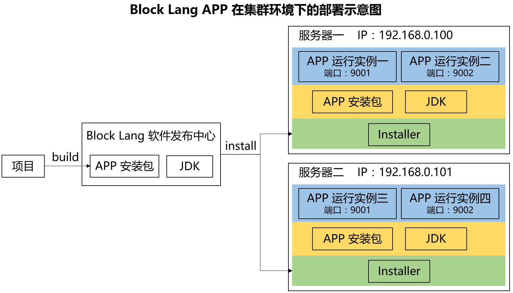

# 需求

## 术语

1. **项目** - 项目是开发阶段的概念，一个软件项目由多种资源组成。
2. **APP** - APP 是发布阶段的概念，一个项目打包发布后形成 APP 发布包，也就是一个 Spring Boot Jar 文件。
3. **APP 发布包** - APP 发布包不包含任何发布环境信息，可以在不做任何调整的情况下部署在任何服务器上，一个项目只会生成一个 Spring Boot Jar 发布包。
4. **应用服务器** - 这里的应用服务器，特指安装了 BlockLang-Installer 工具，用于运行 APP 发布包的服务器。
5. **APP 运行实例** - APP 发布包（Spring Boot Jar）运行在一个端口下，就称为一个 APP 运行实例，一个 APP 发布包可按集群部署，因此一个服务器上可有多个 APP 运行实例，也可以运行在多个不同的服务器上。
6. **Installer** - 每个 APP 运行实例都有一个 installer 管理和监控，因此 BlockLang-Installer 每次向 Block Lang 平台发出一个注册请求后，就会生成一个 installer，并将信息存储在 `config.toml` 文件中。
7. **注册 Token** - Block Lang 会为每个项目生成**一个**注册 token，BlockLang-Installer 使用该注册 token 向 Block Lang 平台发出注册请求。
8. **Installer Token** - BlockLang-Installer 向 Block Lang 平台发出注册请求后，会请求注册一个 installer，Block Lang 为每个 installer 生成一个 token。BlockLang-Installer 后续会使用该 token 来为每个 installer 建立与 Block Lang 平台的链接。

这些概念之间的关系为：

1. **项目**编译并打包为 **APP 发布包**；
2. **BlockLang-Installer** 工具安装在**应用服务器**上；
3. **Installer** 在**应用服务器**上运行 **APP 发布包**，形成 **APP 运行实例**；
4. **BlockLang-Installer** 工具使用**注册 Token** 向 **Block Lang** 平台发出注册申请，并接收到返回的 **Installer Token**；
5. 使用一个**注册 Token** 可申请多个 **Installer Token**。

注意：因为 APP 发布包的充分独立性的特征，因此

1. APP 发布包本身需要配置数据库连接和安装数据库脚本的功能，即不是在打包前配置好数据库连接，然后在启动时同步数据库脚本；而是在运行后配置数据库连接，然后再安装数据库脚本。
2. 数据库连接配置，要同时支持 JDBC 和 JNDI。
3. Jar 文件中可以包含默认端口，但最好在运行时指定端口号。

## 自动化部署流程

1. Block Lang 为每个项目生成唯一的注册 token（由22个数字组成的 Base64 UUID）；
2. 将 BlockLang-Installer 安装在应用服务器上；
3. 执行 `blocklang-installer register` 命令，输入 Block Lang 平台的 `url` 、项目注册 token 和运行 APP 实例的端口号，注册成功后为每个 installer 生成唯一的 token（22个数字组成的 Base64 UUID），并只将 installer token 存在 `config.toml` 文件中（不用存储项目注册 token）；
4. 执行 `blocklang-installer run` 命令，输入运行 APP 实例的端口号，如 `--port 80`，从 Block Lang 平台下载 JDK 和 Spring Boot Jar，并在 Block Lang 平台记录下部署日志和软件下载记录，并运行 Spring Boot Jar；
5. 执行 `blocklang-installer update` 命令，输入运行 APP 实例的端口号，如 `--port 80`，从 Block Lang 平台下载**最新版**的 Spring Boot Jar，并在 Block Lang 平台记录下部署日志和软件下载记录，并运行 Spring Boot Jar；
6. 执行 `blocklang-installer unregister` 命令，输入运行 APP 实例的端口号，如 `--port 80`，来停止 APP 运行实例，并从 `config.toml` 文件中删除对应 installer 注册信息；
7. 执行 `blocklang-installer list` 命令，显示在 `config.toml` 中存储的所有 installer，包括 APP 实例运行端口、Block Lang 平台的 url 和运行实例 token 等。

## APP 运行实例示意图

下图以集群环境为例，描述出上述各概念之间的关系。

