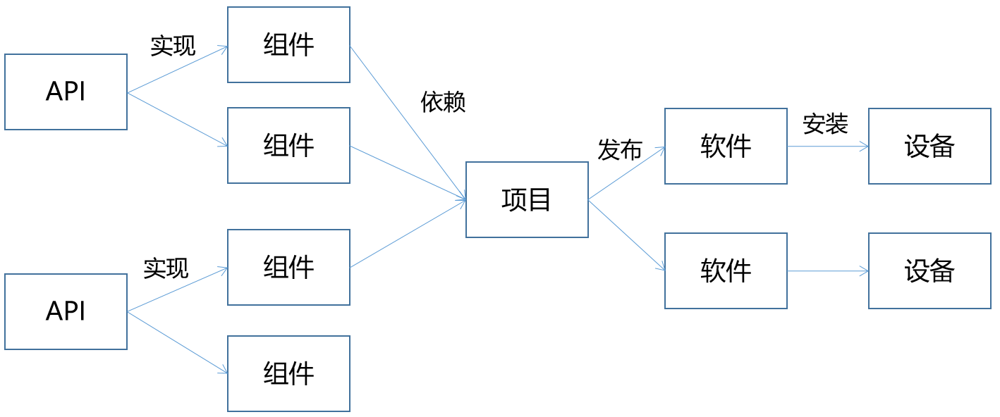

# 组件

组件是可复用的、是对特定功能的封装。我们将 UI 组件称为小部件(Widget)。

在 Block Lang 中，软件是由组件拼装而成的，因此对组件有更严格的规范。

## 待解决的问题

1. 支持跨平台，配置一次后，生成的软件可运行在 web 浏览器上，也可运行在 PC 桌面应用中
   1. 只有一套规范
   2. 但有多套实现，如 Dojo、Vue、React 等实现规范，或 WPF、QT 也实现此规范
2. UI 部件可支持响应式设计
   1. 如果部件不支持响应式设计，则能为不同分辨率配置不同的页面
   2. 如果部件支持响应式设计，则只需配置一套页面
3. 要能编译出多套版本
4. UI 部件和其他组件一样，都遵循相同的模式

## 实现方式

如上图所示：

1. 为每个组件定义一个 API 项目，专门描述组件接口；
2. 为每个 API 项目定义多套组件项目，可使用不同的编程语言或组件实现，但必须遵循 API 项目中的规范；
3. 项目依赖多版本组件，包含两类依赖：
   1. dev 依赖，专用于开发过程中；
   2. prod 依赖，专用于软件发布，可支持多套 profile，如可发布成 android 原生应用，也可发布成微信小程序。

项目关系说明

1. API 项目用于描述组件接口规范，在 README.md 文件中详细说明接口规范，在 changelog 文件夹下存储 json 格式的组件接口变更记录
2. 组件项目提供具体的实现，要指明对应的 API 项目，也要说明是否可用作 dev 依赖
3. 在项目的依赖配置中，可指定依赖的范围（scope），包括 dev 和 prod 两种，其中 prod 可指定多个 profile，但必须指定一个名为 `default` 的 profile
4. 在发布时，默认按照 `default` 依赖生成软件，用户也可以选择 profile 发布

## 管理方式

API 和组件源码可托管在基于 git 的源代码托管网站，如 github 或码云等。但在 BlockLang 平台中使用组件时，必须先将这些组件发布到 BlockLang 的组件市场，然后项目直接引用组件市场中的组件。关系如下图：

